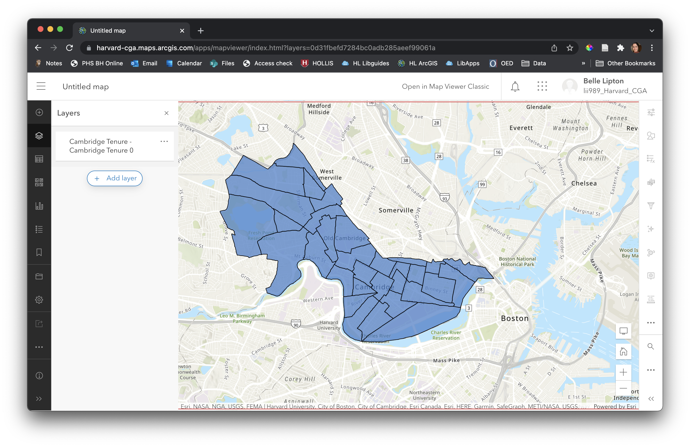

# How to upload local data files to ArcGIS Online

We do not recommend finding mapping data in ArcGIS Online. Once you have found data from [reliable sources](https://harvardmapcollection.github.io/tutorials/census/obtaining-census-data/), use this tutorial to bring your data into a shareable browser map.

## Tutorial data
Download `cambridge-tenure.geoJSON` [here](https://downgit.github.io/#/home?url=https://github.com/HarvardMapCollection/tutorials/blob/main/sample-data/cambridge-tenure.geojson). 

1. Log in to your ArcGIS Online account.
    - [Create a public account](https://doc.arcgis.com/en/arcgis-online/get-started/create-account.htm#ESRI_SECTION1_D91DD2A709AE4FB68A9CC095F1688E05)
    - [Create an account with your Harvard key](https://gis.harvard.edu/arcgis-online)

2. In the main menu, select `Content`.

3. Select `New item`.

4. Upload a file from `Your device`.
> You can upload .geoJSON files as is. Shapefiles must be compressed into a .zip file first.

5. Choose to `Add and create a hosted feature layer`.

6. Follow any prompts. Be sure to populate at least `Title` and `Tags`, as they are necessary to publish the map in any future web or story maps.

7. Select `Save` to publish the service. 

8. This dataset can now be used in a web map. To open the dataset in a web map, select `Open in Map Viewer` (you may have to engage the drop down next to `Open in Map Viewer Classic` to find this option for the more modern map viewer, which this guide is written for).

_Dataset after it has been added to the ArcGIS Online Map Viewer_.

## Save the map
Now that the data has been added, you can begin configuring the map (see tutorial section **Next steps**). After you are finished configuring your map, **make sure** you save the map. If you do not save your map, any StoryMaps you make using this data layer **will not be shareable**. 

1. Click the `Save and open` button in the left-hand menu.

2. Populate the `Title` and `Tags`. If you do not add tags, you can't share this maps or any future maps made with this map.

## Making sense of data in ArcGIS Online

1. Navigate back to your `Content` pane by clicking the `☰` menu icon in the upper-left hand corner of the page, and selecting `Content`.

2. Make note of the ways ArcGIS classifies the different resources we have created. 
> We have added the `GeoJSON`, a `Feature Layer`, and a `Web Map`. If you want to edit any of these items in the future, navigate to the `Content` pane. If you were to create a StoryMap based on this map, a fourth resource would be added titled `Web Mapping Application`. 

## Next steps

- The next step in the [census mapping tutorial](https://harvardmapcollection.github.io/tutorials/census/census2agol/) is learning [How to style the map in ArcGIS Online](https://harvardmapcollection.github.io/tutorials/agol/style-choropleth).
- To learn your way around the ArcGIS Online Map Viewer, visit the [official documentation](https://doc.arcgis.com/en/arcgis-online/get-started/get-started-with-mv.htm).

