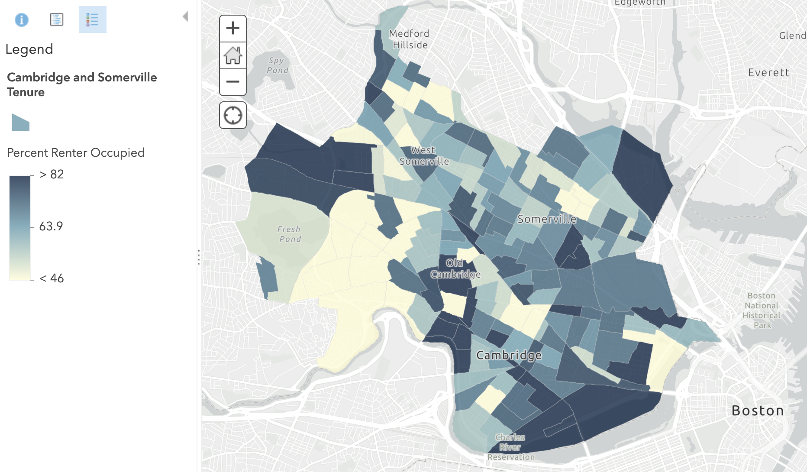
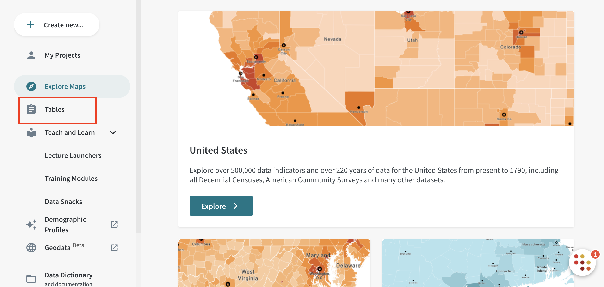
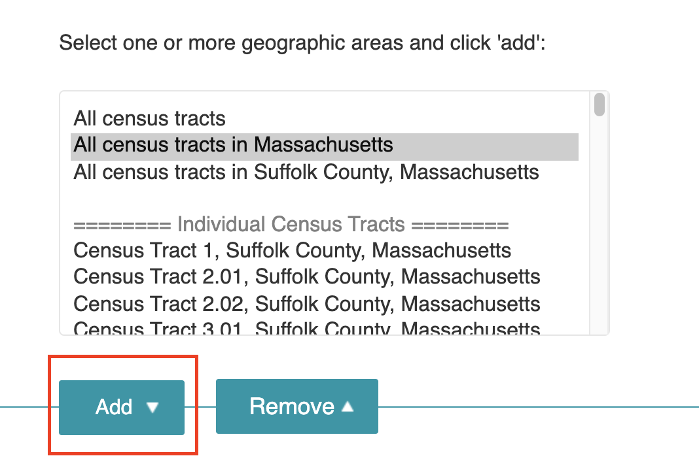
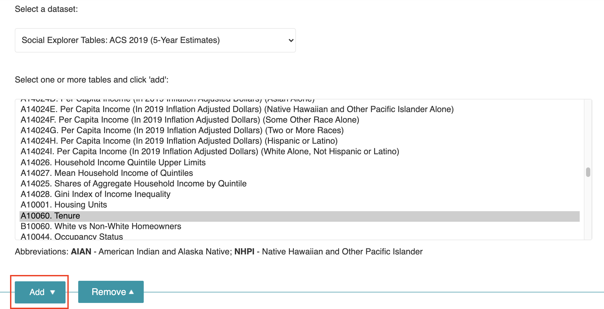
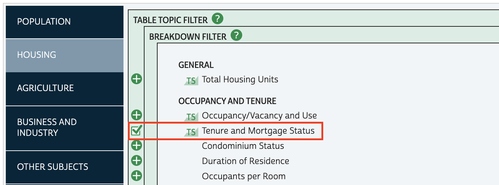
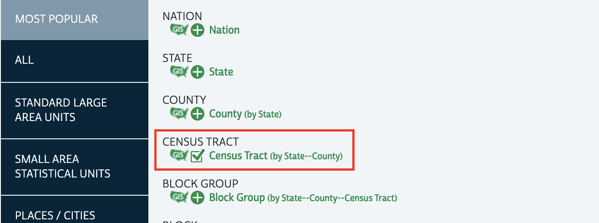
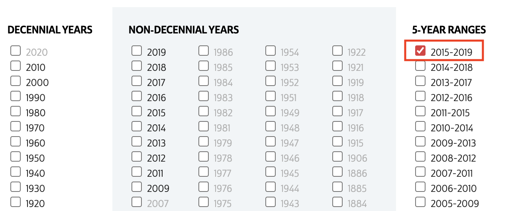
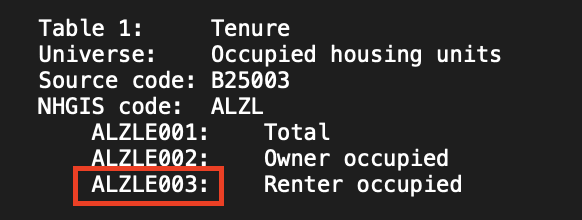

# How to Obtain Census Data for GIS Mapping

Sometimes new mappers are tripped up by census data, because in order to make a map, you  need to download two separate census files:
1. A table of statistics
2. A geography boundary file

## Sources

In this lesson, you will learn how to get these files from your choice of the following sources.

### Social Explorer

- User-friendly
- Requires a license
- [Access Social Explorer via Harvard Key](http://nrs.harvard.edu/urn-3:hul.eresource:socialex)

### NHGIS.org
- Somewhat less intuitive
- No license required
- [Access NHGIS.org for free](https://www.nhgis.org/)

Either choice will provide you with census data well-tailored for GIS methods. We recommend using one of these sources for digital mapping, as opposed to downloading directly from The U.S. Census Bureau portal.

## Example data 
- We will be exploring `tenure` data, which looks at owner vs. renter-occupied units.
- We want census responses that have been aggregated to the **census tract** level.
- Our area of study is near the Harvard campus, in Somerville and Cambridge. 
- We'll be looking at the most recent [estimates](https://www.census.gov/programs-surveys/acs/guidance/estimates.html) at the time this guide was written, 2015-2019.

> **Geography tip:** Census tracts are a popular aggregation unit, as they are more granular than county or state level data, but more available and statistically-reliable than block level data. 

The steps in this tutorial series will work for any U.S. census data, such as age, race, income, etc. If you're not sure which variables are available, you can use [censusreporter.org](https://censusreporter.org/) to find out.

_Example of the tenure data we will work with, uploaded to ArcGIS Online._

## Obtaining via Social Explorer

1. Visit your institution's Social Explorer. Here is the [link for Harvard's Social Explorer](http://nrs.harvard.edu/urn-3:hul.eresource:socialex).

2. If you have an account, log in. Otherwise, you'll have to make one.

3. On the Social Explorer landing page, select `Tables` from the left-hand menu.

4. Since the housing variable is not collected in the full count every ten years, we need to refer the more detailed surveys collected of _sample_ populations on a rolling basis, called the **American Community Survey (ACS)**. Select `American Community Surveys (5-Year Estimates)`.

5. Click `Begin Report` next to the 2015-2019 estimates.

6. Under **Select a Geographic Type** choose `140...Census Tract` from the dropdown menu.

7. Under **Select a State** choose `Massachusetts` from the dropdown menu.

8. Under **Select one or more geographic areas and click 'add'** select `All census tracts in Massachusetts`.

9. Select `Add`.

10. Select `Proceed to Tables`.

11. Under **Select one or more tables and click 'add'** scroll down and select `A10060: Tenure`.

12. Select `Add`.

13. Select `Show Results`.

14. Navigate to the `Data Download` tab.

15. Under **Download data by geography type** select `Census Tract data (CSV)` and the tabular statistical data will download to your computer.

16. Under **Download programs to import and label data** select `Data dictionary (text file)` in order to interpret the dataset.

17. Close out of the report screen by clicking the `X` in the upper-left corner next to **Create Report**.

18. Now from the main menu, select `Geodata`.

19. Scroll down and select `U.S. Tract 1910-2019`.

20. Under **TRACT 2019 US SL140 Coast Clipped** select the button that reads `Shapefile` to download the GIS data you will need for mapping.

You are now ready to move on to the next skill, [How to join data in QGIS](https://harvardmapcollection.github.io/tutorials/qgis/join).

## Obtaining via NHGIS.org

1. Visit NHGIS.org.

2. Select `Get Data`.

3. Select `Topics`. 

4. Select `Housing`.

5. Check off `Tenure and Mortgage Status`.

6. Finalize your topics selection by choosing the `Submit` button.

7. To specify we want to work with census tracts, select `Geographic Levels`.

8. Check off `Census Tract`.

9. Finalize your geographic levels selection by choosing the `Submit` button.

10. To indicate our time frame of 2015-2019, select `Years`.

11. Check off `2015-2019`.

12. Finalize your years selection by choosing the `Submit` button.

13. Under `Source Tables`, check off the **Tenure** data table. This will add the census statistical table to our shopping cart.

14. To change the results that match our criteria from **tables** to **GIS boundary files**, select `GIS Files`.
>Remember, we need both!

15. Checkout by selecting `Continue` from the data cart in the upper-right hand corner of the screen.

16. Accept all of the download defaults.

17. Select `Submit`.
> You will need to create a free login in order to checkout. You can create one in a new tab if you don't want to lose your data selection.

You are now ready to move on to the next skill, [How to focus the data](https://harvardmapcollection.github.io/tutorials/qgis/clip).

### Tips

- It takes a few minutes to prepare your extract. You can either wait and refresh the page, or you will receive an email when the data is ready.
- Extracts come with any accompanying codebook.

- Use this codebook to make sense of the table's field names.

