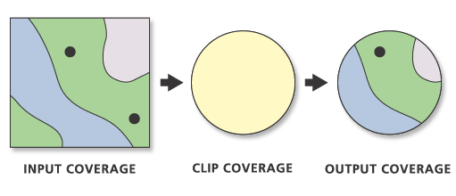
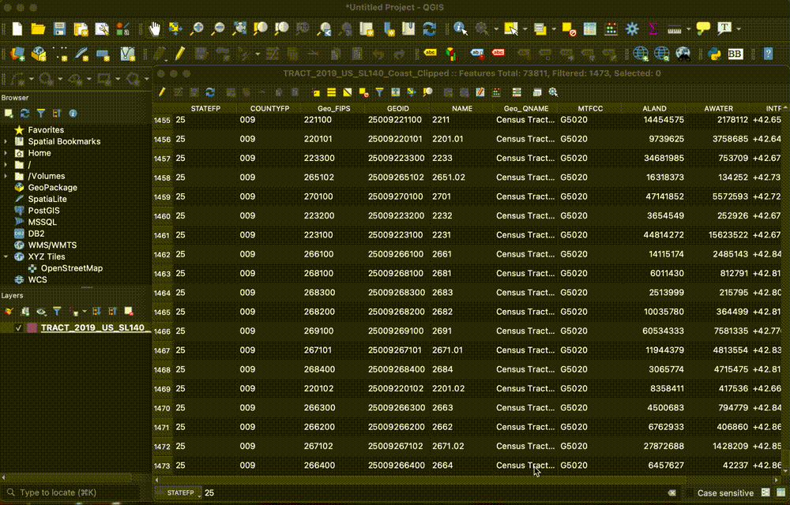
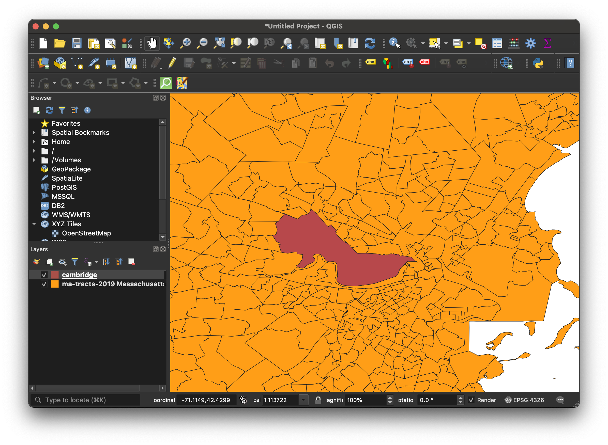
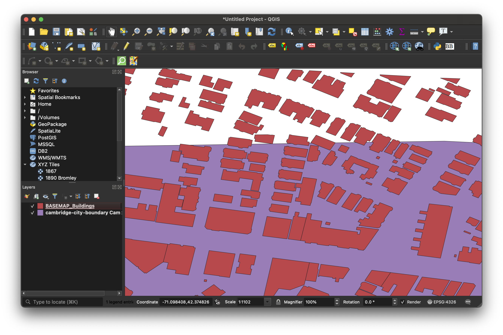
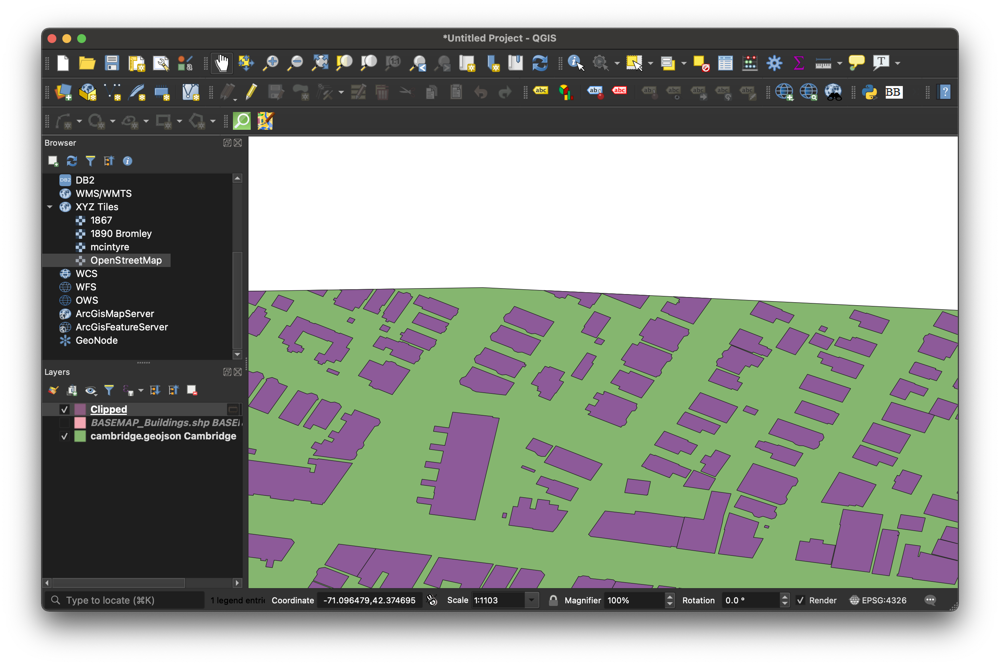

# How to clip GIS data

Clipping is a way of cropping GIS data to a certain extent. 

> From [ESRI documentation on clipping](https://desktop.arcgis.com/en/arcmap/10.3/tools/coverage-toolbox/clip.htm). 

## Why do we clip?
- Larger datasets are more unwieldy and difficult to work with.
- You can create more effective visualizations if your data is focused.

## Tutorial data

In this tutorial you will clip a shapefile of all census tracts in the United States to create a new shapefile of *only* census tracts in Cambridge, Massachusetts. For those who are following the census data [tutorial series](https://harvardmapcollection.github.io/tutorials/census/census2agol/), we will be using the United States Census Tracts file we just created. For those not using the tutorial, you should [download the U.S. Census Tracts file](https://geodata.socialexplorer.com/collection/90937129-3414-434e-a880-e358308654b4). 

Because we are clipping census tracts data to the extent of Cambridge, Massachusetts, you will also need to download a [boundary file for the City of Cambridge, MA.](https://downgit.github.io/#/home?url=https://github.com/HarvardMapCollection/tutorials/blob/main/sample-data/cambridge.geojson).

## Clip by attribute

Before we clip by geography, let's first isolate only census tracts in the state of Massachsuetts. This will make our data much easier to work with, and will make the clipping processes run faster.

### Open the files

1. Open [QGIS](https://harvardmapcollection.github.io/tutorials/qgis/download/). 

2. Add the census tracts file titled `TRACT_2019_US_SL140_Coast_Clipped.shp` to QGIS. 

  
How to add vector files to QGIS

   
  
A predominant spatial data format is the <strong>shapefile</strong>. This is a format created for storing vector data.

  
Vector data consists of:
  <ul>
    <li>points (e.g. landmarks)</li>
    <li>lines (e.g. roads, rivers)</li>
    <li>polygons (e.g. towns, bodies of water)</li>
  </ul>
  
  

Since the advent of geospatial technology, <strong>shapefiles</strong> have been the most common format for storing vector information. Today, other file formats exist for storing vector information, such as the <strong>geopackage (.gpkg)</strong>, or <strong>geoJSON (.geoJSON)</strong>, but shapefiles are still widely used, and many of the datasets you will encounter will come in this format.

<h2>Adding vector data to QGIS</h2>

<ol>
    <li>Open QGIS. </li>
        <li>In QGIS, open a `New empty project`.</li>
    <li>From your computer file directory,  drag the vector data file (shapefile, geojson, geopackage) into the map browser. If your data is in shapefile format, drag the file that ends in the `.shp` extension. You can click through any warning messages about the data projection at this point.</li>

</ol>

<h2>Menu add</h2>

If the quick add approach is not cooperating, you can add data through the menu add.

<ol>
<li>In the menu, select `Layer → Add Layer → Add Vector Layer`.</li>
<li>Under `Source → Vector Dataset(s)` click the browse ellipses.</li>

<li>Navigate to the file you want to add. If it is a shapefile, select the file with the `.shp` extension.</li>

<li>Select `Open`.</li>
<li>Select `Close`.</li>

</ol>

 

### Filter by attribute

1. Open the dataset's attribute table by right-clicking the tracts layer in the layer list, and selecting `Open Attribute Table`.
> Filter the table to only show records that have a [state FIPS code](https://www.nrcs.usda.gov/wps/portal/nrcs/detail/?cid=nrcs143_013696) of 25, the Massachusetts state FIPS code. 

2. In the bottom-right hand corner click `Show All Features`. 

3. Select `Field Filter → STATEFP`.

4. In the search box to the right of `STATEFP` type in `25`. 

5. Press the `enter key`. It will take a long time to return results because there are so many records to search through. 

6. Highlight all of the records in the table by clicking to the left of a row to highlight it, then holding the shift key, and selecting the rest. 
> Any feature you have selected will appear yellow on the map to indicate it is highlighted. All of Massachusetts should be highlighted. 

7. To save just the Massachusetts tracts as a new file, right click on the tracts layer in the layer list and select `Export → Save Selected Features As`.

8. You can accept all defaults, but you need to save the dataset somewhere you will remember by clicking the ellipses (…) button next to file name and naming the file. After you enter a file name, your path should look something like this ...Downloads/ma-tracts-2019.geojson.
> QGIS may default to other vector file formats, such as geopackage (.gpkg) or shapefile (.shp). Any of these formats will work for storing vector data.

9. Select `OK`.

10. Your new dataset will be automatically added to the map. You can free up space by removing the original nation-wide tracts dataset. Do this by right-clicking the U.S. Tracts layer and selecting `Remove layer`.

## Clip by geography

1. Set up your QGIS project so that the layer list contains:
- Census tracts in the state of Massachusetts. This is the file we just made above. You can also [download it here](https://downgit.github.io/#/home?url=https://github.com/HarvardMapCollection/tutorials/blob/main/sample-data/ma-tracts-2019.geojson) 
- The boundary of the municipality of Cambridge. We haven't done anything with this data yet, and if you haven't yet downloaded it, you can [do so here](https://downgit.github.io/#/home?url=https://github.com/HarvardMapCollection/tutorials/blob/main/sample-data/cambridge.geojson)

2. Check to make sure your project looks something like this:

3. Add an opacity slider to the Cambridge boundary layer by following the steps in [this tutorial](https://harvardmapcollection.github.io/tutorials/qgis/adjust-opacity/). Use this to "peer under" the Cambridge boundary data and inspect the tracts we will be isolating via the geographic clip.

4. In the main QGIS menu (banner across the top of the computer screen), select `Vector → Geoprocessing Tools → Clip`. 

5. Input layer is MA tracts. Overlay layer is Cambridge.
> 
- **Input:** Data you want to clip
- **Output:** Clipping boundary (new extent you want to clip *by*)

6. Under `Clipped` select the ellipse three dots icon, pick `Save to file`, and save the new clipped layer somewhere you will remember. You can title the file `Cambridge-tracts`, and save it as either a `shapefile` or `geoJSON`. 
>**Tip:** We prefer [GeoJSON](https://geojson.org/) because it is an open standard, and is only one file instead of six. 

7. Select `Save`.

8. Select `Run`.

9. The new dataset is automatically added to the map. You can toggle off the original two layers in the layer list to make sure your new dataset looks correct.

>**Tip:** Any geoprocessing functions can fail if data layers are set in different coordinate reference systems. If you suspect this might be a problem, you can follow the steps in [this tutorial](https://harvardmapcollection.github.io/tutorials/qgis/change-crs/). 

## Troubleshooting clipping

Clipping by geography is the most straightforward way to clip one dataset to a specific extent. This method, however, can be a bit crude sometimes, and you may need to take other approaches for a more refined result.

In this example we will explain why a simple clip may fall short for your purposes. 

The image above pictures two datasets: (1) buildings and (2) the border or outline of the city of Cambridge. 

When we run a simple clipping function, that process crudely crops one dataset by the other. Here we can see how there are some buildings which straddle the border of Cambridge and the next town over, Somerville. The features for those buildings are being cut off halfway. Sometimes a simple clip will work, but sometimes you may need to use other, more nuanced toolbox functions.

Here, we have used the toolbox function `Extract by location`. This function lets you specify *how* you want the data to be clipped. For instance, you can choose to extract all building features that fall *within* the boundary of Cambridge, as is pictured in the image above. 

The image above pictures the extraction options. For instance, you can extract all data that falls within, intersects, contains, or overlaps the other dataset. 

### Extract by location 

To use the **extract by location** tool, navigate to `Processing → Toolbox → Vector Selection →  Extract by Location`. The processing tab is found in the main header, pictured below.

Under `Extract features from` select the dataset you want to clip.

Under `By comparing features from` select the dataset you want to clip _by_ (the desired extent).

