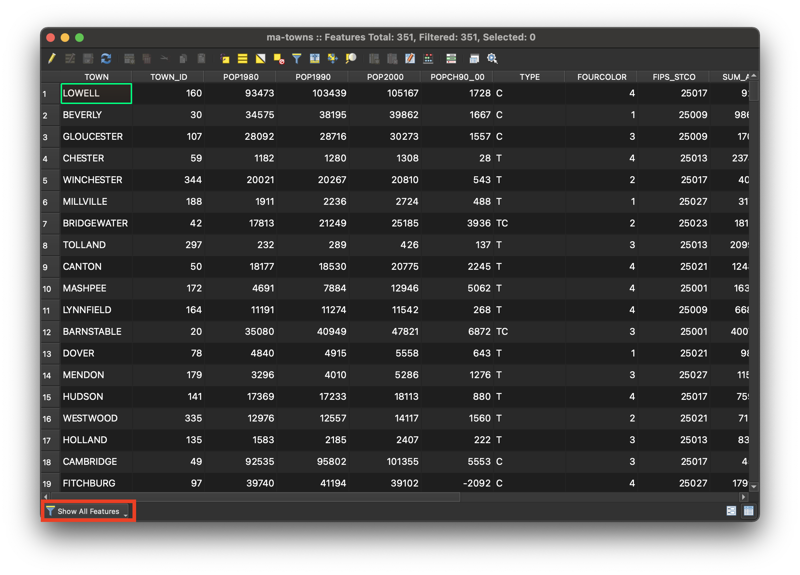

## How to export selected features in QGIS

One helpful technique in GIS software is the ability to quickly create filtered subsets of a GIS dataset. You may want a new dataset that only contains features of a certain type (e.g. only water bodies of a certain depth, or only school locations serving K-12 populations). Alternatively, you may want to select features based on their location.

In this tutorial, we will start with a dataset of all 351 towns in Massachusetts, and create a new dataset that only shows the boundary of Cambridge, MA. 

1. Download the [example dataset](https://downgit.github.io/#/home?url=https://github.com/HarvardMapCollection/tutorials/blob/main/sample-data/ma-towns.geojson).

2. Add the downloaded .geojson to a new QGIS project by following the steps in [this tutorial](https://harvardmapcollection.github.io/tutorials/qgis/open-vector/).

3. Open the dataset's underlying **attribute table** by right-clicking on the data layer in the layer list, and selecting `Open Attribute Table`.

Here you see a table where each row corresponds to one polygon feature on the map. Each row represents a town. There is a column with town name. We can run a filter to only return records with a specific value. 

4. At the bottom of the attribute table, select the dropdown that reads `Show All Features`.

5. Hover over `Field Filter` and select `TOWN`.

6. In the search bar type in "Cambridge", and press enter. All of the records that have the value `CAMBRIDGE` in the column for town name will return. There is only one, since we are working with a dataset that has one polygon feature for every MA town.

7. Highlight the records you want to include in your new dataset by clicking to the left of where the row begins (the number `1`). If you want to select multiple records you can select the first row, hold down the `shift` key, and then select the last row in the sequence you want to highlight.

8. Close out of the attribute table by clicking the `x` in the upper left hand corner of the table interface.

9. On the map, you should see all selected features appearing as yellow, in this case, only the municipality of Cambridge.

10. To create a new dataset, right click on the towns layer in the layer list, and select `Export → Save Selected Features As`.

11. You can accept all defaults, but you need to save the dataset somewhere you will remember by clicking the ellipses (...) button next to file name and naming the file. After you enter a file name, your path should look something like this `...Downloads/Cambridge.geojson`.

12. Select `Okay`.

13. Your new dataset will be automatically added to the map. You can toggle off the original towns dataset by clicking the check mark next to the layer in the layer list to see only the new Cambridge dataset.

## More resources

Extensive [documentation for working in the QGIS attribute table](https://docs.qgis.org/3.4/en/docs/user_manual/working_with_vector/attribute_table.html) exists for techniques such as editing the data, creating new subset data, and constructing useful filters and expressions. 